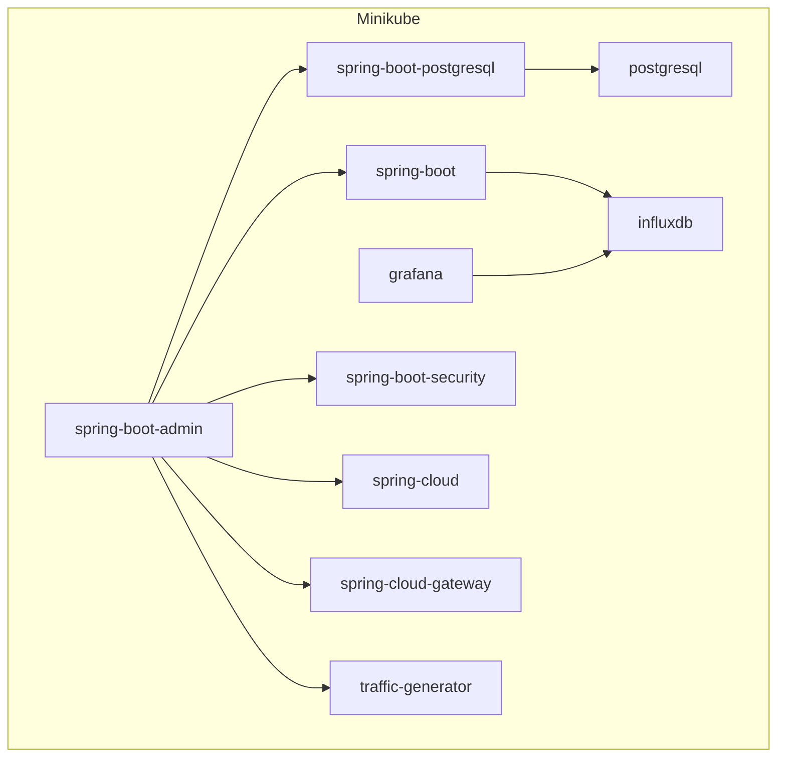

# Java / Kotlin enterprise technologies sandbox

## Prerequisites

* Maven
* JDK v8 (v11 for some modules)

Installed Docker is preferable but is not required

## Credentials

Most services use `sandbox`/`sandbox` as user/password pairs

## Modules

### Sandbox modules:

* [kotlin sandbox](sandboxes/kotlin)
* [spring-boot sandbox](sandboxes/spring-boot)
* [spring-boot-postgresql sandbox](sandboxes/spring-boot-postgresql)
* [spring-boot-security sandbox](sandboxes/spring-boot-security)
* [spring-cloud sandbox](sandboxes/spring-cloud)
* [spring-cloud-gateway sandbox](sandboxes/spring-cloud-gateway)

### Other modules

* infrastructure - useful scripts and docker-compose.yaml files
* maven-parents - sandbox modules use them
* shared
    * shared-resources
    * shared-utils

## Minikube (local Kubernetes)

If you set up everything you will get this deployment:

### Windows automations

To set up everything:

1. [Install winget](https://docs.microsoft.com/en-us/windows/package-manager/winget/) if needed
2. Run `.\infrastructure\minikube\install-or-upgrade-all.ps1` (May require restarting terminal)
3. Run in 1st terminal
    * `.\infrastructure\minikube\start.ps1`
4. Run in 2nd terminal
    * `minikube tunnel`
6. Run in 3rd terminal
    * `helm dependency update .\infrastructure\helm\sandbox-chart`
    * `helm upgrade --install sandbox .\infrastructure\helm\sandbox-chart`
    * Wait for all pods to be in `Running` state ...
    * `minikube service --all` 

To stop minikube:

* Run `.\infrastructure\minikube\stop.ps1`

To remove all installed software:
* Run `.\infrastructure\minikube\uninstall-all.ps1`